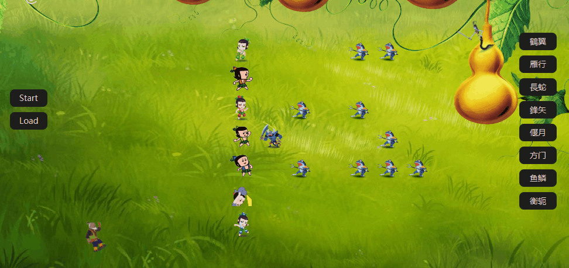

# Final Project @author CC
- 葫芦娃大战妖精，系JAVA课程大实验。

- 葫芦娃与蝎子精带领的喽啰们在草地上自动战斗直到一方全部阵亡，爷爷与蛇精在阵地后排观战。


## 项目概述
### 项目目录与构建

- `/Demo`: 预存的精彩站斗日志
- `/mdSupport`: 实现`README`的辅助图片
- `/src`: 源代码以及资源文件
- `/test`: 测试文件

- 通过命令`mvn clean test package`即可得到`/target/calabash-1.0-SNAPSHOT.jar`可执行文件。

### 使用说明

  - 双击可执行文件后即出现游戏默认初始界面，葫芦娃以長蛇阵型出站，妖精们以鶴翼阵型迎战。
  - 点击`start`按钮后战斗开始，开始计时。敌对双方寻找敌人厮杀，相互接触后随即判定其中一方的死亡(该概率由双方初始人数比确定)，死亡后化作墓碑实体。游戏开始`6s`后每隔`3s`随机选择消失一个墓碑，以防战场堵塞。
  - 战斗结束后战斗过程已被记录在`/target/Combat.log`文件中，可以点击`Load`按钮或按下`L`键加载回放该场战斗，若觉得精彩可以重命名后加以保存，新一轮战斗会覆盖`Combat.log`文件。
  - 战斗结束或回放结束后，可变换妖精们的阵型重新战斗。共有八种阵型可供选择，判定胜负的概率也随阵型变化而变化。
  - 项目根目录中`Demo`文件夹已事先存储部分阵型下的精彩站斗，可直接`Load`进行回放。(其中yanyue.log即偃月阵型的回放时间越两分钟)

## 实现细节

### 代码结构说明

#### Main -- 项目程序的出入口

#### package Being

- 生物体类，包含`Being`基类与`Calabash`, `Grandpa`, `Scorpion`, `Snake`, `Soldiers`五个派生类，以及为`Calabash`类服务的枚举类`COLOR`。

  

- 生物体有自己的属性，包括姓名、生死、位置、好坏等，拥有自己生存与死亡时的图片、出场或者胜利动画，以及各自的线程。

  ```java
  public Timer timer = new Timer();
  ```

#### package Field

- 战场类，包括`Field`战场属性类、`FieldControl`战场安置类、`Square`战场基本单元类。
- `Square`战场基本单元，可且仅可放置一个生物体。
- `Field`, `Height = 11, Width = 16`, 由`Square`组成，具有一系列判断战场状态的功能。

```java
boolean posQualified(Position p) //判断位置是否出界
boolean emptySquare(Position p) //判断位置是否为空
Being getLiveBeing(Position p) //返回位置上活着的生物体
Position isBeside(Position p) //判断上下左右是否有敌人，如果有，返回位置
boolean isOpposite(Position a, Position b) //判断位置是否敌对
Position getRandomPos(Position p) //随机返回上下左右的一个可前进方位
Position findNext(Position a, Position b) //返回a到b路径上的下一个位置
```

- `FieldControl`, 是`Field`与`Being`类的聚合，主要功能在于初始化战场。

```java
void initField(String formation) {
    //以formation阵型初始化战场
    field.clearField();
    scorpion.setFormation(formation);
    this.setAlive(); //全部复活
    this.setField(); //将生物体放到战场上
    field.qualified = true; //初始化完成的flag
}
```

#### package Formation

- 阵型类，共"鶴翼", "雁行", "長蛇", "鋒矢", "偃月", "方门", "鱼鳞", "衡轭"八种阵型，只有蝎子精可以变阵。

```java
public static Integer max = 18; //最大人数
public String name; //阵型名
public Position leader; //参照点位置
public ArrayList<Position> pos = new ArrayList<>(); //相对于参照点的位置集合
```

#### package Position

- 位置类，具有横纵坐标的属性，并且可返回上下左右四个方位的位置。

#### package Sort

- 排序类，可打乱葫芦娃的顺序、按葫芦娃姓名冒泡排序，按葫芦娃颜色二分排序。

#### package FileControl

- 文件回放类，拥有自己的线程，可以加载、解析、写入、回放文件

```java
private Timer replayTimer = new Timer();
private File loadFile() //通过FileChooser选择文件
private ArrayList<String> parseFile(File file) //装饰器模式解析文件，存储在字符串列表
	reader = new BufferedReader(new FileReader(file));
private void writeFile(String filename, String Log) //将日志写入文件
	writer = new BufferedWriter(new FileWriter(filename, false));
public void replayGame() //开启线程开始回放
```

#### package GameControl

- `GuiControl`GUI实现类
  - 图形界面的实现类，实现了`Text`/`Label`/`Timeline`/`Button`等一系列控件，以及刷新界面的功能。

- `GameLogic`游戏逻辑类，游戏在此初始化，所有生物体线程在此并发。
  - `GuiControl`图形界面类、`FieldControl`战场控制类、`FileControl`文件回放类的聚合。
  - **三者相互交互实现本游戏的主逻辑**。
  - 用户通过`GuiControl`上的`Button`操作。
    - `Start`游戏开始多线程并发。
    - `Load`经由文件回放`FileControl`单线程进行。
    - 八个`ChangeFormation`的按钮经由`FieldControl`的初始化。

### 主要功能思想

#### 多线程并发，每个生物体得到自己的线程。

```java
//考虑到每隔一段时间定时执行操作的需求，我发现实现TimerTask的run()接口是很不错的选择。
//通过synchronized对代码加锁以实现多线程并发的安全
private synchronized TimerTask getTask(Being en) {
    return new TimerTask() {
        @Override
        public void run() {
            Platform.runLater(() -> {
                //生物体逻辑
            });
        }
    };
}
for (Calabash c : brothers)
    c.timer.scheduleAtFixedRate(getTask(c), 1000, 1000);
scorpion.timer.scheduleAtFixedRate(getTask(scorpion), 1000, 1000);
for (Soldiers s : soldiers)
    s.timer.scheduleAtFixedRate(getTask(s), 1000, 1000);

//刷新屏幕线程
refreshTimer.scheduleAtFixedRate(new TimerTask() {
    @Override
    public void run() {
        //刷新屏幕逻辑
    }
}, 100, 500);

//清理墓碑线程
clearTimer.scheduleAtFixedRate(new TimerTask() {
    @Override
    public void run() {
		//清理墓碑逻辑        
    }
},6000, 3000);//6s后每3s清空一个墓碑
```

### 文件读写、输入输出、异常处理

```java
//考虑到读写文件是消耗较大的操作
//使用字符串缓存使得每次游戏只需一次读取或写入操作
private ArrayList<String> parseFile(File file) {
    if(file == null) return buffer;
    BufferedReader reader;
    try {
        //装饰器模式
        reader = new BufferedReader(new FileReader(file));
        String text;
        while((text = reader.readLine()) != null) {
            buffer.add(text);
        }
    } catch (IOException e) {
        throw new RuntimeException("加载存档错误");
    }
    try {
        reader.close();
    } catch (IOException e) {
        throw new RuntimeException("关闭流失败");
    }
    return buffer;
}

public void writeFile(String filename, String Log) {
    try {
        //装饰器模式
        BufferedWriter writer = new BufferedWriter(new FileWriter(filename, false));
        writer.write(Log);
        writer.close();
    } catch (IOException e) {
        throw new RuntimeException("存档错误!");
    }
}

//响应键盘
class KeyParse implements EventHandler<KeyEvent> {
    public void handle(KeyEvent event) {
        if (!GameLogic.isGaming || !GameLogic.isReplaying) {
            if (event.getCode() == KeyCode.L)
                fileReplay.replayGame();
        }
    }
}
```

### 单元测试

对战场阵型逻辑以及葫芦娃排序功能，使用第三方测试工具`junit`进行针对测试。

### 设计原则

1. 单一职责、聚合复用
   - `GuiControl`, `FieldControl`, `FileReplay`等类各司其职、互不干扰、聚合实现游戏逻辑。
2. 开放封闭
   - 生物体类通过实现抽象基类`Being`的`setView`方法完成对自己图像的初始化。
3. 里氏替换
   - 生物体类均可替换`Being`基类。
4. 接口隔离
   - 不存在“胖子”类。

## 项目特点

### 动画丰富、阵型齐全

***阵型变换***


***战斗胜利***


***回放清晰***



***计时功能***


### 清理墓碑、不会堵死

```java
//设置一个墓碑列表
//每次生物死亡记录墓碑位置
//定时随机选取墓碑消失
private ArrayList<Position> tomb = new ArrayList<>(); //墓碑列表
```

### 一次游戏、一次读写

```java
//一次游戏就是一次字符串，文件读写只一次
private String combatLog; //记录战斗的字符串
combatLog = "New Log\n" + "Game Start\n" + scorpion.getFormation().name + '\n';
/*...*/
if // Calabash win
    combatLog += "Calabash win\n";
else
    combatLog += "Soldiers win\n";
```

### Lambda表达式

```java
//在setonAction时十分好用
Button buttonStart = new Button("Start");
buttonStart.setOnAction((ActionEvent t) -> playGame());
Button buttonLoad = new Button("Load");
buttonLoad.setOnAction((ActionEvent t) -> fileReplay.replayGame());

Button button1 = new Button("鶴翼");
button1.setOnAction((ActionEvent t) -> forceRestart("鶴翼"));
Button button2 = new Button("雁行");
button2.setOnAction((ActionEvent t) -> forceRestart("雁行"));
/*...*/
```

## 总结与致谢

首先不后悔选择了这门课程，但最后的考试确实让我认识到了`JAVA`语言的博大精深以及自己所下功夫的严重欠缺，平时没有能够在每一次课后及时应用所学的知识到代码中、没有能够结合书籍详细地实操，是一个很深的教训，更能体会到了老师们的良苦用心。

课程的结束、大作业的完成，是我精通`JAVA`是起点，感谢老师与助教的辛勤付出。
